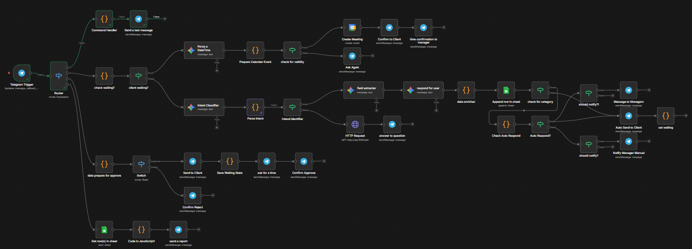
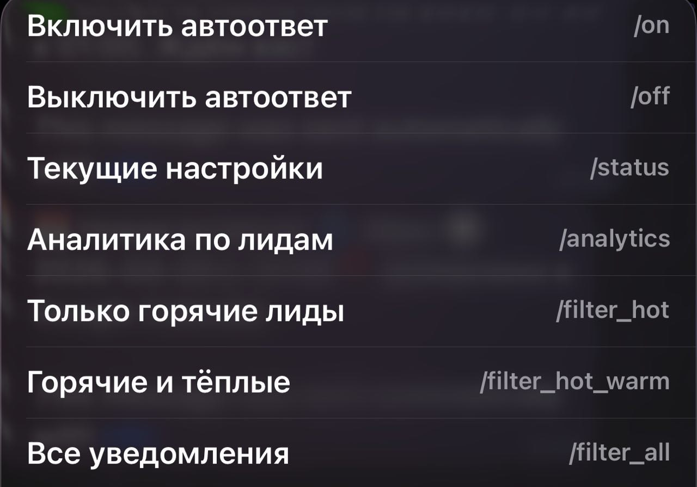
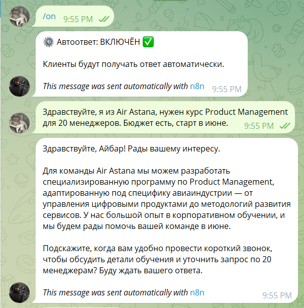
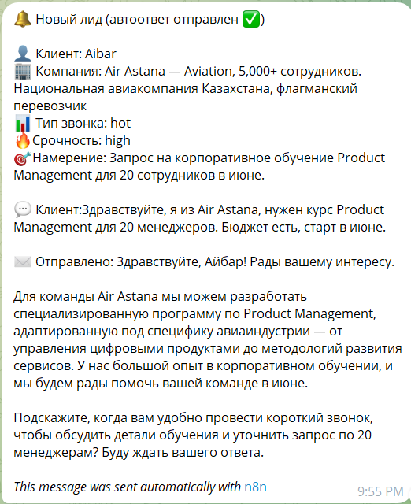
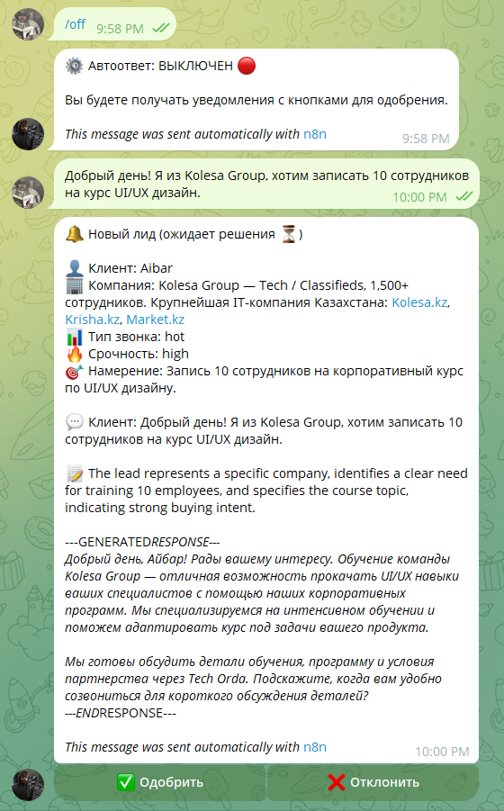
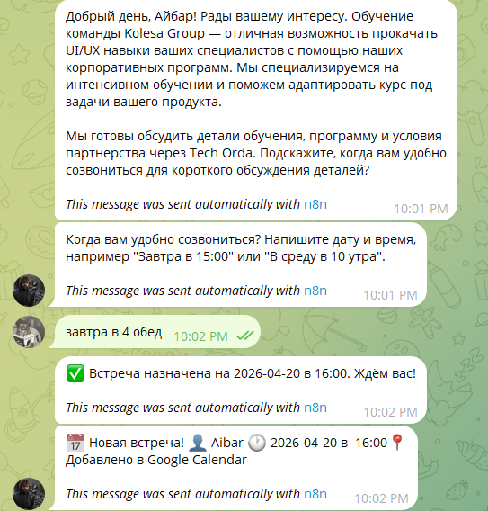
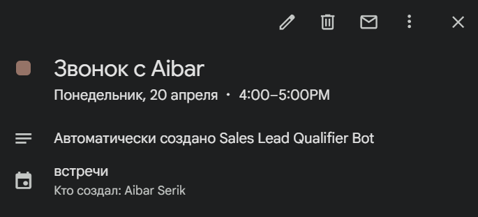
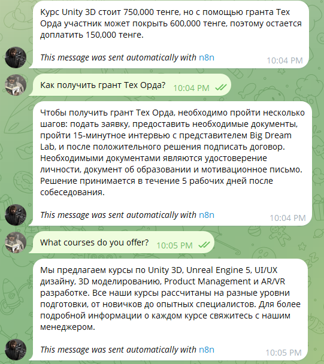
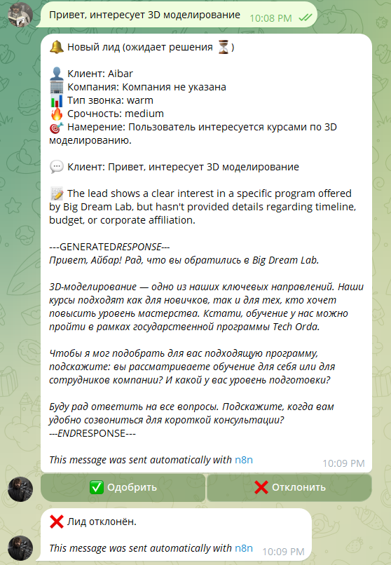
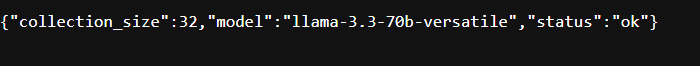

# 🤖 Big Dream Lab — AI Sales & Support Platform

An AI-powered Telegram bot that automates lead qualification, customer support, and meeting scheduling for [Big Dream Lab](https://bigdreamlab.kz), an educational company in Astana, Kazakhstan.

## What It Does

One Telegram bot handles everything:

- **Client writes a request** → AI classifies the lead (hot/warm/cold), generates a personalized response, saves to CRM, and notifies the manager
- **Client asks a question** → RAG system searches company documents and answers with source references
- **Manager approves a lead** → bot sends the response to the client and schedules a Google Calendar meeting
- **Manager configures the bot** → auto-respond on/off, notification filters, analytics — all through Telegram commands

## Architecture

```
┌─────────────────────────────────────────────────────────┐
│                    Telegram Bot API                     │
└──────────────────────┬──────────────────────────────────┘
                       │
┌──────────────────────▼──────────────────────────────────┐
│                 n8n Workflow Engine                     │
│                                                         │
│  ┌─────────┐  ┌──────────┐  ┌────────┐  ┌──────────┐    │
│  │ Router  │→ │ Gemini   │→ │ Google │→ │ Telegram │    │
│  │ (Switch)│  │ (LLM x3) │  │ Sheets │  │ Notify   │    │
│  └────┬────┘  └──────────┘  └────────┘  └──────────┘    │
│       │                                                 │
│       │  ┌──────────────┐   ┌────────────────┐          │
│       └→ │ Google       │   │ RAG Service    │          │
│          │ Calendar API │   │ (HTTP Request) │          │
│          └──────────────┘   └───────┬────────┘          │
└─────────────────────────────────────┼───────────────────┘
                                      │
┌─────────────────────────────────────▼───────────────────┐
│              Python RAG Microservice                    │
│                                                         │
│  ┌─────────────┐  ┌──────────┐  ┌──────────────────┐    │
│  │ Flask API   │→ │ ChromaDB │→ │ Groq (Llama 3.3) │    │
│  │ /ask        │  │ Vector   │  │ Answer Generator │    │
│  └─────────────┘  │ Search   │  └──────────────────┘    │
│                   └──────────┘                          │
└─────────────────────────────────────────────────────────┘
```

Both services run in Docker Compose — one command starts everything.

## Features

### Lead Qualification
- **AI Classification** — Gemini classifies incoming leads as hot, warm, or cold based on buying intent, company mention, budget, and timeline
- **Personalized Response Generation** — AI writes a custom response for each lead based on their message, company, and category
- **Company Enrichment** — local database of major Kazakh companies (Kaspi Bank, Halyk Bank, Kolesa Group, Air Astana, etc.) with automatic fuzzy matching via LLM normalization
- **Multi-language** — responds in the same language as the client (Russian, English)
- **Google Sheets CRM** — every lead is recorded with timestamp, category, company info, generated response

### RAG Knowledge Base
- **Document-based Q&A** — answers questions about courses, pricing, grants, and company info from indexed documents
- **Semantic Search** — ChromaDB vector database with sentence-transformers embeddings
- **Source Attribution** — every answer includes document sources
- **Intent Detection** — Gemini automatically distinguishes between purchase requests (leads) and information questions (RAG)

### Manager Tools
- **Auto-respond ON/OFF** — `/on` sends responses automatically, `/off` requires manual approval via inline buttons
- **Human-in-the-loop** — when auto-respond is off, manager reviews AI-generated response and approves (✅) or rejects (❌)
- **Notification Filter** — `/filter_hot` shows only hot leads, `/filter_hot_warm` for hot+warm, `/filter_all` for everything
- **Analytics Dashboard** — `/analytics` shows lead stats, top courses, top companies for the last 2 days and all time
- **Google Calendar Integration** — after approving a lead, bot asks the client for preferred meeting time, parses the response, and creates a Google Calendar event

### Bot Commands
| Command | Description |
|---------|-------------|
| `/on` | Enable auto-respond |
| `/off` | Disable auto-respond |
| `/status` | Current settings |
| `/analytics` | Lead analytics report |
| `/filter_hot` | Notify only for hot leads |
| `/filter_hot_warm` | Notify for hot and warm |
| `/filter_all` | Notify for all leads |

## Tech Stack

| Component | Technology |
|-----------|------------|
| Workflow Engine | n8n (self-hosted) |
| LLM (Classification & Response) | Google Gemini 2.5 Flash-Lite |
| LLM (RAG Answers) | Groq — Llama 3.3 70B |
| Vector Database | ChromaDB |
| Embeddings | sentence-transformers (paraphrase-multilingual-MiniLM-L12-v2) |
| CRM | Google Sheets API |
| Calendar | Google Calendar API |
| Bot Interface | Telegram Bot API |
| API Framework | Flask (Python) |
| Containerization | Docker Compose |
| Tunnel (dev) | ngrok |

## Quick Start

### Prerequisites
- Docker Desktop
- ngrok account (free)
- Google Cloud project with Sheets & Calendar APIs enabled
- Telegram bot (via @BotFather)
- Gemini API key (Google AI Studio)
- Groq API key (console.groq.com)

### Setup

1. Clone the repository:
```bash
git clone https://github.com/aibarC/sales-lead-qualifier.git
cd sales-lead-qualifier
```

2. Copy environment template and fill in your keys:
```bash
cp .env.example .env
```

3. Start ngrok tunnel:
```bash
ngrok http 5678
```

4. Update `WEBHOOK_URL` in `.env` with your ngrok URL.

5. Start all services:
```bash
docker compose up -d --build
```

6. Open n8n at `http://localhost:5678`, import `workflow.json`.

7. Configure credentials in n8n (Telegram, Gemini, Google Sheets, Google Calendar).

8. Publish the workflow.

### Verify

- n8n: `http://localhost:5678`
- RAG health: `http://localhost:5000/health`
- RAG test: `http://localhost:5000/ask?q=What courses do you offer?`

## Project Structure

```
sales-lead-qualifier/
├── .env.example          # Environment template
├── .gitignore
├── docker-compose.yml    # n8n + RAG services
├── workflow.json         # n8n workflow export
├── README.md
└── rag/
    ├── Dockerfile
    ├── requirements.txt
    ├── app.py            # Flask RAG server
    ├── indexer.py         # Document indexer (semantic chunking)
    └── data/
        ├── courses.txt
        ├── payment_and_grants.txt
        ├── faq.txt
        └── company.txt
```

## RAG Knowledge Base

The RAG system is built on Big Dream Lab's actual course offerings:

| Course | Duration | Price |
|--------|----------|-------|
| Unity 3D | 6 months | 750,000 ₸ |
| Unreal Engine 5 | 7 months | 850,000 ₸ |
| UI/UX Design | 5 months | 550,000 ₸ |
| 3D Modeling & Animation | 6 months | 700,000 ₸ |
| Product Management | 4 months | 500,000 ₸ |
| AR/VR Development | 5 months | 800,000 ₸ |

The system also handles Tech Orda grant information — a government program covering up to 600,000 ₸ of tuition.
## Screenshots

### Workflow Architecture
The entire n8n workflow — one bot handles lead qualification, RAG Q&A, calendar scheduling, analytics, and manager commands.



### Bot Commands
Managers control the bot through Telegram's built-in command menu — auto-respond, filters, analytics, all accessible with one tap.



### Auto-Respond Mode (ON)
When auto-respond is enabled, the bot immediately sends an AI-generated response to the client and notifies the manager with a summary.



Manager receives a detailed notification confirming the auto-response was sent, including client info, company enrichment, lead category, and the generated response.



### Manual Mode with Approve/Reject Buttons (OFF)
When auto-respond is disabled, the manager receives the lead with inline buttons. The AI-generated response is included for review before sending.



### Google Calendar Integration
After approving a lead, the bot asks the client for a preferred meeting time, parses the response using Gemini, and automatically creates a Google Calendar event.





### RAG Knowledge Base
The bot answers questions about courses, pricing, and grants by searching through indexed company documents. Responses include relevant information from multiple sources.



### Lead Rejection
Managers can reject leads with one tap. The client receives no response, and the manager gets confirmation.



### RAG Service Health
The Python RAG microservice runs alongside n8n in Docker Compose, with a health endpoint for monitoring.




## Planned Features

- **Follow-up Reminders** — auto-remind manager if client hasn't responded within 24 hours
- **Calendar Slot Checking** — verify manager's availability before scheduling
- **Auto-respond Schedule** — `/schedule 09:00-18:00` for time-based auto-respond
- **Kazakh Language RAG** — multilingual embeddings (e.g. multilingual-e5-large) for full Kazakh support
- **PDF Upload Indexing** — manager sends PDF to bot → automatically indexed into RAG


## Disclaimer

This is a **demo prototype** built as a portfolio project. In a production environment, the following improvements would be necessary:

- **Security**: proper secret management (e.g. HashiCorp Vault), HTTPS without ngrok, rate limiting
- **Scalability**: n8n cloud or self-hosted with PostgreSQL backend, horizontal scaling for RAG service
- **Reliability**: error handling, retry logic, logging and monitoring (e.g. Grafana)
- **Data**: production database instead of Google Sheets, proper CRM integration (HubSpot, Salesforce)
- **Multi-language RAG**: multilingual embeddings (e.g. multilingual-e5-large) for full Kazakh language support
- **Testing**: unit tests, integration tests, load testing

**Author:** Aibar Serik
**GitHub:** [github.com/aibarC](https://github.com/aibarC)
**LinkedIn:** [linkedin/aibar-serik](https://www.linkedin.com/in/aibar-serik-755278315/)
